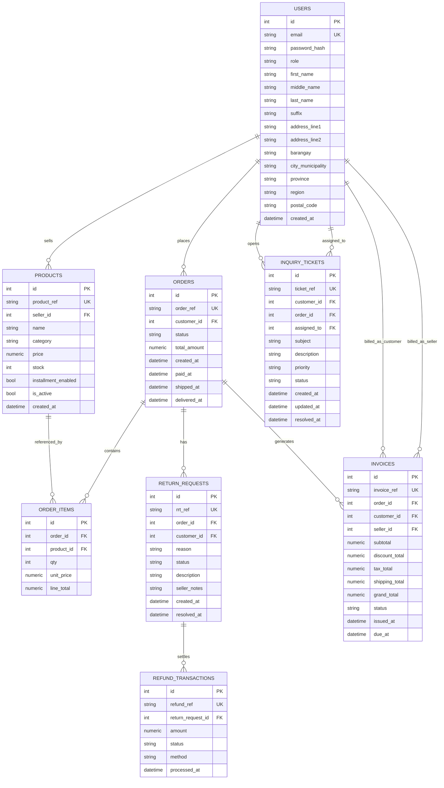

# Master Routing and System Change Plan

This document merges:
- `ROUTING_SCHEME.md` (current canonical routing)
- `PLAN_ON_CHANGING_THE_SYSTEM.md` (mentor-driven changes)

It is intentionally split into **Current State** and **Target State** to prevent contradictions.

## 1) Current State (Already Implemented)

## 1.1 Portal boundaries
- Public: landing, auth, browse/shop.
- Customer: `/customer/*` plus customer shopping aliases.
- Seller: `/seller/*`.
- Admin: `/admin/*`.

## 1.2 Canonical routes in use

### Public
- `/`
- `/landing`
- `/auth/login`
- `/auth/register`
- `/shop`
- `/products/<ref>`

### Customer
- `/customer/home`
- `/customer/cart`
- `/customer/checkout`
- `/customer/checkout/success`
- `/customer/orders`
- `/customer/orders/<order_ref>`
- `/customer/returns`
- `/customer/loyalty`
- `/customer/profile`
- `/customer/profile/edit`

### Seller
- `/seller/dashboard`
- `/seller/products`
- `/seller/products/new`
- `/seller/products/<ref>/edit`
- `/seller/products/<ref>/delete` (POST)
- `/seller/orders`
- `/seller/orders/<order_ref>`
- `/seller/returns`
- `/seller/vouchers`
- `/seller/analytics`
- `/seller/financial-analytics`
- `/seller/installment-payments`
- `/seller/customer-inquiries`
- `/seller/customer-accounts`
- `/seller/crm-analytics`
- `/seller/inventory`
- `/seller/inventory-analytics`
- `/seller/delivery-services`
- `/seller/payouts`
- `/seller/profile`
- `/seller/security`

### Admin
- `/admin/dashboard`
- `/admin/sellers`
- `/admin/sellers/<seller_id>`
- `/admin/products`
- `/admin/customers`
- `/admin/audit`
- `/admin/settings`
- `/admin/reports`

## 1.3 Legacy redirects retained
- `/seller/customer-orders` -> `/seller/orders`
- `/seller/return-transactions` -> `/seller/returns`
- `/seller/sales-analytics` -> `/seller/analytics`

## 1.4 Implemented routing policy
- Customer, seller, and admin portals stay separated.
- Cross-role deep linking is blocked by role guard logic.
- Handoff is data-driven (orders/returns), not URL-driven.

## 2) Target State (Mentor Requirements)

## 2.1 Data standardization

### Name fields
Split identity fields into:
- `first_name`
- `middle_name`
- `last_name`
- `suffix`

Apply in registration, profile edit, customer account pages, and reports.

### Address fields + postal logic
Split address into:
- `address_line1`
- `address_line2`
- `barangay`
- `city_municipality`
- `province`
- `region`
- `postal_code`

Postal code behavior:
- Auto-suggest based on `city_municipality`.
- Allow manual override with validation.

## 2.2 Invoice requirement
- Add invoice records for paid/confirmed orders.
- Customer and seller should both access invoice views with role-based restrictions.

## 2.3 Reporting requirement (Crystal-style output)
- Reports must export to:
  - PDF
  - Excel
- Admin/seller reports should be generated from real transactional data.

## 2.4 CRM requirements

### Customer inquiries
- Manual ticket entry is required.
- Ticket fields: ref, subject, status, assigned user, timestamps, customer/order links.

### Refund transactions
- Must be connected to customer return/refund flow (`/customer/returns` -> `/seller/returns`).
- No standalone hardcoded refund entries.

### Customer accounts
- Keep existing UI structure.
- Remove hardcoded rows.
- Bind to customer profile + ordering data.

### Retention and engagement
- Remove hardcoded metrics.
- Source metrics from repeat purchases, order history, and voucher usage.

### Vouchers
- Keep current UI shell.
- Remove hardcoded details and bind to DB.

## 3) Reconciled Routing Expansion (No Conflicts)

These are additions/extensions that do not contradict current canonical routes.

### Customer additions
- `/customer/invoices`
- `/customer/invoices/<invoice_ref>`
- Optional: `/customer/profile/address`

### Seller additions
- `/seller/inquiries`
- `/seller/inquiries/new`
- `/seller/inquiries/<ticket_ref>`
- `/seller/retention-engagement`
- `/seller/invoices`
- `/seller/invoices/<invoice_ref>`

### Refund transactions routing note
To avoid contradiction with current canonical routing:
- Canonical remains: `/seller/returns`
- Optional alias/tab route: `/seller/refund-transactions` -> handled by or redirected to `/seller/returns`

### Admin report exports
- `/admin/reports/export/pdf`
- `/admin/reports/export/excel`

## 4) Data Model Additions

## 4.1 Customer/User profile
- Add normalized name + structured address columns.
- Keep compatibility fallback from old `full_name` while migrating.

## 4.2 Inquiry tickets
- `inquiry_tickets`: `ticket_ref`, `customer_id`, `order_id`, `subject`, `description`, `status`, `priority`, `assigned_to`, timestamps.

## 4.3 Invoices
- `invoices`: `invoice_ref`, `order_id`, `customer_id`, `seller_id`, totals, status, issue/due dates, optional export path.

## 5) End-to-End Workflow (Logical Handoff)

1. Customer places order via checkout.
2. Paid/confirmed order triggers invoice generation.
3. Customer return request is filed in `/customer/returns`.
4. Seller handles request in `/seller/returns`.
5. Refund transaction records derive from return workflow updates.
6. Reports and CRM dashboards consume real DB records.

## 6) Hardcoded Data Removal Plan

- `seller/customer_accounts.html`: replace static content with DB query output.
- `seller/customer_inquiries.html`: replace static rows with ticket dataset.
- `seller/crm_analytics.html`: replace static KPIs with computed metrics.
- `seller/vouchers.html`: replace static voucher cards with DB-backed list.
- Any static return/refund examples: replace with joined return/order/customer data.

## 7) Phased Delivery Plan

### Phase 1: Schema
- Add name/address fields, ticket model, invoice model.

### Phase 2: Service wiring
- Invoice generation on qualifying order state transitions.
- Ticket create/update lifecycle.
- Refund transaction linkage to return workflow.

### Phase 3: Route/UI integration
- Add invoice and inquiry routes.
- Bind CRM screens to real data.

### Phase 4: Reporting
- Implement report exports (PDF/Excel) for admin/seller.

### Phase 5: QA
- Verify role access controls.
- Verify data integrity across profile/order/returns/invoice/report flows.

## 8) Acceptance Criteria

- No hardcoded CRM business records remain.
- FN/MI/SN/Suffix supported end-to-end.
- Structured address + postal suggestion/validation works.
- Invoices generated and accessible by authorized roles.
- Reports export to PDF and Excel.
- Refund transactions are traceable to customer return/refund records.

## 9) Database Handling Strategy for Render (Student Budget)

Goal: reliable production database with near-zero cost, while keeping local development simple.

### 9.1 Recommended setup
- Local development: SQLite (fast and free for local testing).
- Production deployment: PostgreSQL.
- App runtime (Render Web Service): connect via `DATABASE_URL`.

### 9.2 Budget-first options
- Option A (best if available in your account): Render PostgreSQL starter/free plan.
- Option B (most practical for students): host app on Render and use free PostgreSQL from Neon or Supabase.
- Option C (temporary only): keep SQLite on Render disk. Not recommended for scale/reliability and may break with ephemeral filesystem behavior.

Decision: use PostgreSQL in production, even on free tiers, for compatibility and data safety.

### 9.3 Why PostgreSQL is the best solution here
- Better concurrency than SQLite for multi-user customer/seller/admin traffic.
- Strong relational integrity (foreign keys, constraints) for orders/returns/invoices.
- Easier migrations and future analytics/reporting.
- Works naturally with SQLAlchemy and Flask deployment patterns.

### 9.4 Configuration pattern
- Use environment-based config:
  - `DATABASE_URL` for production.
  - fallback to SQLite for local if unset.
- Enable SQLAlchemy pool pre-ping and conservative pool settings for free tiers.
- Run migrations on deploy (Flask-Migrate/Alembic).

## 10) ERD (Target Logical Model)

## 11) Database Schema Blueprint (PostgreSQL)

Use this as the migration target structure (via Alembic), not as raw one-shot SQL in production.

### 11.1 Core constraints and indexes
- Unique refs: `users.email`, `products.product_ref`, `orders.order_ref`, `return_requests.rrt_ref`, `inquiry_tickets.ticket_ref`, `invoices.invoice_ref`.
- Foreign keys with cascade rules:
  - `order_items.order_id -> orders.id` (cascade delete)
  - `order_items.product_id -> products.id`
  - `return_requests.order_id -> orders.id`
  - `refund_transactions.return_request_id -> return_requests.id`
  - `invoices.order_id -> orders.id`
- Indexes:
  - `orders(customer_id, created_at)`
  - `orders(status)`
  - `products(seller_id, is_active)`
  - `return_requests(status, created_at)`
  - `inquiry_tickets(status, priority, created_at)`

### 11.2 Suggested enum-like fields (as constrained text)
- `users.role`: `customer|seller|admin`
- `orders.status`: `pending|paid|packed|shipped|delivered|past_due|refunded|cancelled`
- `return_requests.status`: `pending|accepted|rejected|refunded`
- `inquiry_tickets.status`: `open|in_progress|resolved|closed`
- `inquiry_tickets.priority`: `low|medium|high|urgent`

## 12) Data Security Design (Auth, AuthZ, Encryption)

### 12.1 Authentication
- Continue Flask-Login session auth.
- Password hashing: `werkzeug.security.generate_password_hash` using strong method (pbkdf2/scrypt default from Werkzeug version).
- Add rate limiting for login attempts (Flask-Limiter) and lockout policy.
- Enable secure session cookie flags:
  - `SESSION_COOKIE_SECURE=True`
  - `SESSION_COOKIE_HTTPONLY=True`
  - `SESSION_COOKIE_SAMESITE='Lax'`

### 12.2 Authorization
- Enforce role-based access in route guards (`customer`, `seller`, `admin`).
- Add object-level authorization checks:
  - seller can only access their own products/order items/returns.
  - customer can only access own orders/invoices/returns.
  - admin has elevated read/write per policy.

### 12.3 Encryption
- In transit: HTTPS (Render provides TLS endpoint).
- At rest: managed DB provider encryption at rest (Render/Neon/Supabase managed storage).
- Application secrets in environment variables only (`SECRET_KEY`, `DATABASE_URL`, email/API secrets).

### 12.4 Data protection controls
- CSRF protection for all state-changing forms (`Flask-WTF` or equivalent token middleware).
- Input validation and output escaping (Jinja auto-escape + server-side validation).
- Audit logging for admin-sensitive actions.
- Minimal PII retention in logs (never log password/token/raw card data).

### 12.5 Backups and recovery (free-tier friendly)
- Prefer provider with daily backups on paid tier; if unavailable on free tier:
  - nightly export using `pg_dump` to private storage.
  - keep at least 7 daily snapshots.
- Test restore monthly on a staging database.

## 13) Student-Friendly Deployment Checklist (No/Low Cost)

1. Keep local DB as SQLite for coding speed.
2. Create free PostgreSQL instance (Render if available, else Neon/Supabase).
3. Set `DATABASE_URL` in Render service environment.
4. Run migrations during deploy.
5. Seed only minimal demo data for portfolio/testing.
6. Turn on secure cookies + CSRF + login throttling.
7. Verify invoice/report exports and role access before submission/demo.

## 14) Recommended Final Decision

Best practical solution for your case:
- Deploy Flask app on Render.
- Use PostgreSQL as production DB (Render Postgres if your plan includes it; otherwise Neon/Supabase free tier).
- Keep SQLite only for local development.

This gives the strongest balance of cost, reliability, and compatibility for a student project.
